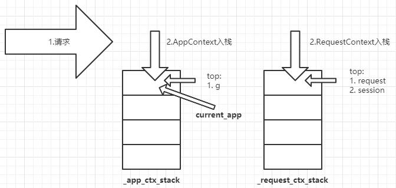

> 1. When a Flask application begins handling a request, it pushes an application context and a request context.   
> 2. When the request ends it pops the request context then the application context.   
> 3. Typically, an application context will have the same lifetime as a request.
# 1. 上下文为了解决的问题
## 1.1. 应用上下文
1.  在模块中，如果在使用例如`config`这种`app`的属性的话，需要导入`app`。这样的话容易出现循环导入的问题
    > importing the app instance within the modules in your project is prone to circular import issues.
2.  当处理请求时，flask自动push一个`_app_ctx_stack`。并使用`current_app`作为它的代理，指向处理当前请求的应用
## 1.2. 请求上下文
1.  当flask处理请求时，会根据一个`Request`对象，因为`worker`一次只能处理一个请求，在请求期间，该对象作为`worker`的全局数据。`request`作为它的代理
2.  这个上下文对于每个线程是唯一的，即实现的线程隔离，防止数据的混乱
# 2. 本地上下文实现
1.  在flask\globals.py中，定义了一系列本地上下文对象
    ```python
    _request_ctx_stack = LocalStack()
    _app_ctx_stack = LocalStack()
    current_app = LocalProxy(_find_app)
    request = LocalProxy(partial(_lookup_req_object, "request"))
    session = LocalProxy(partial(_lookup_req_object, "session"))
    g = LocalProxy(partial(_lookup_app_object, "g"))
    ```
    1.  `_app_ctx_stack`、`_request_ctx_stack`用于存放每次请求push的上下文对象
    2.  `current_app`用于作为当前`_app_ctx_stack`最后入栈的上下文对象的代理
    3.  `request`、`session`作为属性存放在`_request_ctx_stack.top`中，`request`、`session`为`_request_ctx_stack.top`中同名属性的代理
        
    4.  `g`上下文属性代理，可以在`g`中存放需要使用的全局数据
## 2.1. `Local`
1.  `Local`对象内部维护`__storage__`、`__ident_func__`属性。`__storage__`初始化时为空数组；`__ident_func__`初始化为`get_ident`函数，当使用`greenlet`时，`get_ident`为当前`greenlet`的`id`，当使用线程时，`get_ident`为当前线程`id`。无论哪种方式，`id`都是唯一的
    ```python
    def __init__(self):
        object.__setattr__(self, "__storage__", {})
        object.__setattr__(self, "__ident_func__", get_ident)
    ```
2.  访问`Local`
    1.  `Local`自定义了`__getattr__`方法
        ```python
        def __getattr__(self, name):
            try:
                return self.__storage__[self.__ident_func__()][name]
            except KeyError:
                raise AttributeError(name)
        ```
    2.  当访问属性时，返回的是`self.__storage__`中`dict`的值
    3.  `dict`的`key`为`self.__ident_func__()`，即当前线程的唯一id，`value`就是实际存储的数据
        1.  `1380`为当前线程id
        2.  `{'stack': [<RequestContext ...]}`为`LocalStack`向`Local`存数据时设定的。`stack`为一个`List`
        
3.  赋值`Local`
    1.  赋值时同样使用了自定义的`__setattr__`方法
        ```python
        def __setattr__(self, name, value):
            ident = self.__ident_func__()
            storage = self.__storage__
            try:
                storage[ident][name] = value
            except KeyError:
                storage[ident] = {name: value}
        ```
    2.  以`self.__ident_func__()`为键，存放在`self.__storage__`中
4.  迭代`Local`：返回`self.__storage__`的迭代器
    ```python
    def __iter__(self):
        return iter(self.__storage__.items())
    ```
5.  释放`Local`
    1.  调用`__release_local__`方法时`self.__storage__`将pop当前线程id
6.  调用`Local`：返回`LocalProxy`对象
## 2.2. `LocalStack`
1.  应用上下文由`LocalStack`初始化，`LocalStack`的核心为`Local`对象，以操作`Local`对象中的两个属性为主
    1. 应用上下文初始化
    ```python
    _app_ctx_stack = LocalStack()
    ```
    1. LocalStack初始化
    ```python
    def __init__(self):
        self._local = Local()
    ```
2.  `LocalStack`栈操作
    1.  入栈
        1.  首先判断`self._local`即（`Local`）是否包含`stack`属性
        2.  如果没有，则初始化`stack`为`list`，并赋值给`self._local`。注意`Local`对象实现了`__setattr__`方法，`stack`实际赋值给了`self.__storage__[self.__ident_func__()]`
        
        ```python
        manager = LocalStack()
        manager.push({'a': 12})
        ```
        1.  赋值完毕后返回`self.__storage__[self.__ident_func__()]`的值
    2.  出栈
        1. 首先判断`self._local`即（`Local`）是否包含`stack`属性
        2. 如果`stack`为`None`，则返回`None`
        3. 如果`stack`长度为1，则调用`Local`的`__release_local__()`方法，清空`self.__storage__`，此时`self.__storage__`为一个空`dict`
        ```python
        def __release_local__(self):
            self.__storage__.pop(self.__ident_func__(), None)
        ```
        4. 如果上述两个条件未满足，则弹出最右端元素
    3.  栈顶元素：返回`list`中的最右端元素
3.  调用`LocalStack`
    1.  定义了名为`_lookup`的闭包方法，返回`LocalProxy`对象。该方法返回`self.__storage__[self.__ident_func__()]`最右边的一个元素
    ```python
    return self._local.stack[-1]
    ```
    2.  与`Local`不同的地方在于，`Local`传入`LocalProxy`的参数没有限制，而`LocalStack`是将方法传入`LocalProxy`
## 2.3. `LocalProxy`
1.  初始化
    1.  将传入对象赋值给`self.__local`。如果参数是可执行对象或者不是`Local`、`LocalStack`对象，则将参数赋值给`self.__wrapped__`，以便可以访问未被装饰器装饰的原始对象
    ```python
    if callable(local) and not hasattr(local, "__release_local__"):
        object.__setattr__(self, "__wrapped__", local)
    ```
2.  返回被代理对象
    1.  如果`self.__local`没有`__release_local__`属性，则返回`self.__local()`，即执行后的结果。
    ```python
    if not hasattr(self.__local, "__release_local__"):
        return self.__local()
    ```
    2.  如果上述条件未满足，则在被代理的对象中查找是否存在`self.__name__`，若没有则抛出异常
    ```python
    getattr(self.__local, self.__name__)
    ```
## 2.4. `LocalManager`
1. 可以通过`ident_func`控制线程id的值
2. 可以通过`make_middleware`将`app`包装起来，当`app`执行结束后自动释放`LocalManager`中所有的`Local`数据
# 3.  上下文的流程

1.  收到请求时，flask自动向`_app_ctx_stack`和`_request_ctx_stack`中分别push`AppContext`、`RequestContext`