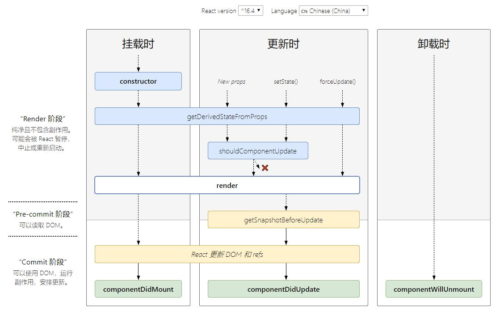

- [渲染DOM](#渲染DOM)
- [state](#state)
- [props](#props)
- [组件](#组件)
- [子元素](#子元素)
- [列表](#列表)
- [表单](#表单)
1. `jsx`是`React.createElement(component, props, ...children)`函数的语法糖，所以必须显示导入`React`库
2. 定义的组件必须以大写字母开头
# 渲染DOM
1. `ReactDOM.render()`
2. 条件渲染
   1. `if`条件
        ```javascript
        if (isLoggedIn) {
            button = <LogoutButton onClick={this.handleLogoutClick} />;
        } else {
            button = <LoginButton onClick={this.handleLoginClick} />;
        }
        ```
   2. 运算符条件
        ```javascript
        {unreadMessages.length > 0 &&
            <h2>
            You have {unreadMessages.length} unread messages.
            </h2>
        }
        ```
   3. 三目运算符：`<b>{isLoggedIn ? 'currently' : 'not'}</b>` 
   4. 阻止条件渲染：`return null`
# state
1. 概念：与`props`类似，但是`state`是私有的，并且完全受控于当前组件
2. 特性：
   1. 初始化: 只能在构造函数中初始化
   2. 赋值: 必须使用`this.setState()`赋值
   3. 赋值合并：调用`setState()`的时候，React会把提供的对象合并到当前的`state`
# props
1. 接收的属性以及子组件转换为单个对象转递给组件，称之为`props`
   ```javascript
    function Welcome(props) {
        return <h1>Hello, {props.name}</h1>;
    }
    const element = <Welcome name="Sara" />;
    ReactDOM.render(
        element,
        document.getElementById('root')
    );
   ```
   * 调用`ReactDOM.render()`函数，传入`<Welcome name="Sara" />`作为参数
   * `React`调用`Welcome`组件，并将`{name: 'Sara'}`作为`props`传入
   * `Welcome`组件将`<h1>Hello, Sara</h1>`元素作为返回值
2. 所有`React`组件都必须像纯函数一样保护它们的`props`不被更改
3. 传递`props`
   * 表达式传递：`<MyComponent foo={1 + 2 + 3 + 4} />`
   * 默认值传递：`<MyTextBox autocomplete />`，与`<MyTextBox autocomplete={true} />`等价
   * 字面量传递：`<MyComponent message={'hello world'} />`
   * 多属性传递：
        ```javascript
        function App1() {
            return <Greeting firstName="Ben" lastName="Hector" />;
        }

        // 等价App1()
        function App2() {
            const props = {firstName: 'Ben', lastName: 'Hector'};
            return <Greeting {...props} />;
        }
        ```
# 组件
1. 函数组件：
   ```javascript
    function Welcome(props) {
        return <h1>Hello, {props.name}</h1>;
    }
   ```
2. 类组件：
   ```javascript
    class Welcome extends React.Component {
        render() {
            return <h1>Hello, {this.props.name}</h1>;
        }
    }
   ```
3. `html`标签赋值
   1. 常量赋值：使用引号
        ```html
        <div tabIndex="0"></div>
        ```
   2. 表达式赋值：使用大括号
        ```html
        </img>
        ```
# 子元素
1. 概念：包含在开始和结束标签之间的`jsx`表达式内容将作为特定属性`props.children`传递给外层组件

2. 传递之前会默认去掉行首尾的空格以及空行
3. 忽略渲染值：布尔类型、`Null`以及`Undefined`
4. 传递子元素：
   * 字面量：`<MyComponent>Hello world!</MyComponent>`
   * `jsx`子元素：
        ```javascript
        <MyContainer>
            <MyFirstComponent />
            <MySecondComponent />
        </MyContainer>
        ```
   * `js`表达式：`<MyComponent>{'foo'}</MyComponent>`
   * 函数：
        ```javascript
        <Repeat numTimes={10}>
            {(index) => <div key={index}>This is item {index} in the list</div>}
        </Repeat>
        ``` 
# 列表
1. 允许在大括号`{}`中嵌入表达式
   ```javascript
   function NumberList(props) {
        const numbers = props.numbers;
        return (
            <ul>
            {numbers.map((number) =>
                <ListItem key={number.toString()}
                        value={number} />
            )}
            </ul>
        );
    }
   ```
2. key：用于列表排序
   * key应该在当前列表中保持唯一
   * key应该保留在组件上：`<ListItem key={number.toString()} value={number} />`
        ```javascript
        function ListItem(props) {
        // 正确！这里不需要指定 key：
            return <li>{props.value}</li>;
        }

        function NumberList(props) {
            const numbers = props.numbers;
            const listItems = numbers.map((number) =>
                // 正确！key 应该在数组的上下文中被指定
                <ListItem key={number.toString()} value={number} />
        );
        return (
                <ul>
                    {listItems}
                </ul>
            );
        }

        const numbers = [1, 2, 3, 4, 5];
        ReactDOM.render(
            <NumberList numbers={numbers} />,
            document.getElementById('root')
        );
        ```
# 表单
## 受控组件：使用`this.state`作为组件数据源，并由`React`控制用户输入过程中表单发生的操作
1. `textarea `：使用`value`属性替换文本`<textarea value={this.state.value} onChange={this.handleChange} />`
2. `select`标签：
   ```javascript
    <select value={this.state.value} onChange={this.handleChange}>
        <option value="grapefruit">葡萄柚</option>
        <option value="lime">酸橙</option>
        <option value="coconut">椰子</option>
        <option value="mango">芒果</option>
    </select>
   ```
## 非受控组件
1. `<input type="file"/>`标签：`value`只读
2. 默认值：`<input defaultValue="Bob" type="text" ref={this.input} />`
## `refs`
1. 概念：Refs 提供了一种方式，允许我们访问 DOM 节点或在 render 方法中创建或修改 React 元素
2. 何时使用：
   1. 管理焦点，文本选择或媒体播放
   2. 触发强制动画
   3. 集成第三方 DOM 库
3. 避免使用`refs`来做任何可以通过声明式实现来完成的事情
4. `refs`会在`componentDidMount`或`componentDidUpdate`生命周期函数触发前更新
5. 创建`refs`：`React.createRef()`
   1. 通常将`refs`分配给实例属性：`this.myRef = React.createRef()`
6. 访问`refs`：通过`current`属性访问引用的节点，`this.myRef.current`
   1. 作用于HTML：创建的`ref`接收底层`DOM`元素作为其`current`属性
        ```javascript
        <input type="text" ref={this.textInput} />
        ```
      * `DOM`挂载时：向`current`传入`DOM`元素
      * `DOM`卸载时：向`current`传入`null`。
   2. 作用于类组件时：
      * `ref`对象接收组件的挂载实例作为其`current`属性
      * 接收实例后，可以调用组件的方法
   3. 不能在函数组件上使用`ref`属性
7. 父组件访问`refs`：
   1. `refs`转发：
      1. 概念：将`ref`自动地通过组件传递到其子组件
8. 回调`refs`
# `PropTypes`
1. 概念：用于开发模式下的类型检查
   ```javascript
   class.defaultProps = {
       name: 'name'
   }
   ```
# `defaultProps`
1. 定义`props`的默认值
   ```javascript
   import PropTypes from 'prop-types';
   class.propTypes = {
       num: propTypes.number
   }
   ```
# 回调事件
1. 在调用时使用`bind()`绑定：`<button onClick={this.run.bind(this,'args')}>`
2. 在构造函数中使用`bind()`绑定：`this.run = this.run.bind(this,'args');`
3. 使用箭头函数
   ```javascript
    run = (e) => {
        alert(this.state.name)
    }
   ```
# 生命周期

1. 组件加载时
   1. 构造函数
   2. `componentWillMount()`
   3. `render()`
   4. `componentDidMount()`
2. 组件数据更新时
   1. `shouldComponentUpdate(nextProps, nextState, nextContext)`：必须返回`true`
      1. `nextProps`：更新前的数据
      2. `nextState`：更新后的数据
   2. `componentWillUpdate(nextProps, nextState, nextContext)`
   3. `render()`
   4. `componentDidUpdate(prevProps, prevState, snapshot)`
3. 向子组件传递`props`时
   1. `componentWillReceiveProps(nextProps, nextContext)`
4. 组件销毁时
   1. `componentWillUnmount()`

