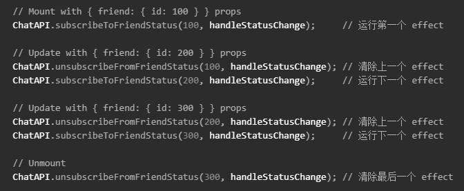

- [概念](#概念)
- [基础`Hooks`](#基础hooks)
  - [1. `useState`](#1-usestate)
  - [2. `useEffect`](#2-useeffect)
  - [3. `useContext`](#3-usecontext)
- [额外`Hooks`](#额外hooks)
> 1.`Hook`是`React 16.8`的新增特性。  
> 2.它可以让你在不编写`class`的情况下使用`state`以及其他的`React`特性。
# 概念
1. `Hook`是`JavaScript`函数
2. 可以使用`Hooks`从组件中提取状态逻辑，使在无需修改组件结构的情况下复用状态逻辑
3. `Hook`将组件中相互关联的部分拆分、组合成函数，而并非强制按照生命周期划分（即相同逻辑的代码放在同一个函数中，由`useEffect`管理生命周期，而非像之前一样，将代码拆分到各个生命周期中）
# 基础`Hooks`
## 1. `useState`
```javascript
const [state, setState] = useState(initialState);
```
1. 返回一个变量`state`，以及更新`state`的函数`setState`。
2. `useState()`方法返回了一个数组，使用解构语法，可以将返回值设置为任意名称
3. 如果需要管理多个`state`，只需要调用多次`useState()`
   ```javascript
   const [age, setAge] = useState(42);
   const [fruit, setFruit] = useState('banana');
   const [todos, setTodos] = useState([{ text: '学习 Hook' }]);
   ```
4. 变量`state`
   * `state`初始值与`initialState`值相同
   * `initialState`可以是任何类型的值(`null`、`Number`、`String`、`Object`)
5. 函数`setState`
   * 用于更新`state`：`setState(newState);`
6. 使用：`<button onClick={() => setCount(count + 1)}>Click me</button>`
## 2. `useEffect`
```javascript
useEffect(effect: EffectCallback, deps?: DependencyList)
```
1. 可以看作`componentDidMount`、`componentDidUpdate`和`componentWillUnmount`这三个生命周期函数的组合
2. 执行条件
   * 每轮组件渲染后完成执行
   * 当`deps`未发生变化时，`useEffect`不执行
   * 当`deps`传递一个空数组时，`useEffect`只在组件挂载、卸载时执行
3. 返回值
   ```javascript
   useEffect(() => {
      ChatAPI.subscribeToFriendStatus(props.friend.id, handleStatusChange);
      return () => {
         ChatAPI.unsubscribeFromFriendStatus(props.friend.id, handleStatusChange);
      };
  });
   ```
   * 当组件卸载时，执行返回值中的内容
4. `useEffect`内部调用顺序
   
5. 函数`effect`
   * 是一个包含命令式、且可能有副作用代码的函数
     * 副作用：数据获取、订阅或者手动修改过`DOM`的操作
6. 变量`deps`：`effect`依赖的数据，当`deps`发生变化时，`useEffect`才执行
## 3. `useContext`

# 额外`Hooks`