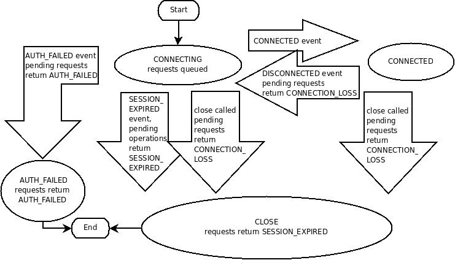

> version: 3.6.2

### `data model`
1. 使用具有层次结构的名称空间管理`znode`, 每个`znode`都可以拥有数据及子节点. 类似文件系统每个`znode`为一个路径, 到节点的路径表示为绝对的、斜杠分隔的路径: `/node1/node2`. 并没有相对路径的概念
2. `path`命名
   * 不允许使用`\u0000 - \u001F`、`\u007F`、`\u009F`、`\ud800 - \uF8FF`、`\uFFF0 - uFFFF`
   * 不允许单独使用`.`, `.`可以作为名称的一部分
   * `zookeeper`为保留字
### `znode`
1. `znode`维护了一个`stat`信息, 比如数据修改、`ACL`修改的版本号
2. 版本号随着数据的修改而增加, 客户端必须提供相应的版本号才能正确操作`znode`
3. 特性
   * `watches`: 客户端可以为一个`znode`设置`watches`, 对`znode`的修改会触发并清空`watches`. `zk`会向`watches`节点的客户端发送通知
   * `data access`: 每个节点的访问权限控制
   * `ephemeral nodes`: 临时节点. 会话结束后会删除, 不允许有子节点
   * `sequence nodes`: 可以在路径末尾附加一个单调递增的计数器, 计数器对于父节点来说是唯一的. 计数器的格式为`%010d`. 计数器由父节点维护
### `Stat Structure`
1. `zxid`: 事务`id`. 每次修改`zookeeper`状态会生成一个唯一的`zxid`, 可以用于表示修改的前后顺序
   * `czxid`: 创建时的`zxid`
   * `mzxid`: 最后修改此节点的`zxid`
   * `pzxid`: 最后修改子节点的`zxid`
2. `version numbers`: 当节点被修改时, `version numbers`会自增1
   * `dataVersion`: 数据修改时自增
   * `cversion`: 当前节点的下一级节点被修改时自增
   * `aclVersion`: 修改`ACL`时自增
3. `ctime`: 创建节点时的时间
4. `mtime`: 最后修改此节点的时间
5. `ephemeralOwner`: 如果此节点为临时节点, 值为节点拥有者的会话`id`; 否则为0
6. `dataLength`: 数据的长度
7. `numChildren`: 子节点的数量
### `Session`
    
1. 连接时可以在`url`后附件节点路径: `localhost:2181/node1/node2`
2. `zk`会给连接的客户端分配会话`id`(64位数字). `zk`会将随机创建的密码、会话`id`一起发送至客户端用于握手
### `Watches`
1. 特性
   * `watches`只触发一次, 想要继续`watches`节点, 需要重新进行`watches`操作
     * `3.6.0`新增特性, 可设置`persistent watches`. 触发后不会删除; 并监听当前节点与子节点的修改
   * `watches`回调可以保证顺序执行, 监视事件的顺序与`zk`操作顺序相同
   * 客户端首先看到事件通知, 然后才能看到相应数据
2. `watches type`
   * `persistent watches`: 永久触发
   * `persistent recursive watches`: 永久触发, 不触发`NodeChildrenChanged`事件
   * `standard watches`: 只触发一次
3. `watches event type`
   * `NodeDataChanged`
   * `NodeChildrenChanged`
   * `NodeCreated`
   * `NodeDeleted`
   * `PersistentWatchRemoved`
4. 添加`watches`
   * 客户端 
     * `getData()`、`exists()`: 设置数据`watches`
     * `getChildren()`: 设置子节点`watches`
   * `cli`: `addWatch path`
5. 方法与事件的关系
    | |exists()|getData()|getChildren()|
    |---|---|---|---|
    |created event|y|||
    |deleted event|y|y|y|
    |changed event|y|y||
    |child event|||y|