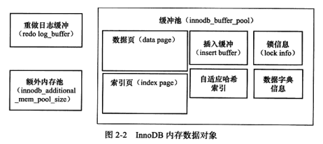

# 概述
1. 第一个完整支持`ACID`事务的`MySQL`存储引擎
   * `atomicly`: 原子性
   * `consistency`: 一致性
   * `isolation`: 隔离性
   * `durability`: 持久性
# 体系结构

## 后台线程
1. `master thread`: 将缓冲池中的数据异步刷新到磁盘 
   * 刷新脏页
   * 合并`insert buffer`
   * 回收`undo`页等
2. `IO thread`: 
   * 使用`AIO`来处理写`IO`请求
   * 线程类型: 
     * `write thread`: 4个
     * `read thread`: 4个
     * `insert buffer thread`: 1个
     * `log IO thread`: 1个
   * `write thread`与`read thread`可以使用`innodb_read_io_threads`和`innodb_write_io_threads`设置
3. `purge thread`: 回收已经使用并分配的`undo`页
4. `page cleaner thread`: 刷新脏页
## 内存

### 缓冲池
1. 概念
   * 一块内存区域, 通过内存速度弥补磁盘速度
   * 缓冲池实例可以有多个, 每个页根据哈希值平均分配到不同缓冲池实例中
   * 表`information_schema.INNODB_BUFFER_POOL_STATS`可以查看缓冲池状态
2. 页: `innodb`基于磁盘存储, 记录按照页的方式进行管理
   * 默认为`16kb`
     * 支持压缩页
   * 对页的修改将首先修改缓冲池中的页
   * 然后通过`check point`的机制刷新回磁盘上
3. 缓存命中: 
   * 读取页(数据)时, 先将页放在缓冲池中
   * 下次读取相同的页时, 首先判断该页是否在缓冲池中. 若在, 则称为缓存命中, 直接读取页; 否则读取磁盘上的页
4. 缓冲池淘汰(`LRU list`与`Free list`)
   * `LRU list`
     * 通过`LRU(latest recent used, 最近最少使用)`算法管理
     * 频繁使用的页存放在`LRU list`的头部, 最少使用的在尾部. 当不能存放时, 首先释放`LRU list`中尾端的页
     * 新读取到的页, 放入`midpoint`处, 而不是放在`LRU list`的开头. 默认在`LRU list`的`5/8`处
     * `midpoint`之前的列表为`young`列表, 之后的列表为`not young`列表
   * `Free buffers`
     * `page made young`: 从`not young`列表转入`young`列表的操作
     * `page not made yound`: 由于`innodb_old_blocks_time`导致页没有从`not young`列表转入`young`列表的操作
5. `young`列表保护(热数据保护)
   * 使用`innodb_old_blocks_time`参数保护`young`列表
   * 即新读取到的页, 会首先插入到`midpoint`处, 即`old`列表的首部
   * 此页在`innodb_old_blocks_time`时间后被读取时, 会转移到`young`列表的头部
   * 此策略可以保证`young`列表中的数据会维持一段时间, 而不会被频繁更换
    
6. 缓冲池相关参数
   * 修改缓冲池大小: `innodb_buffer_pool_size`
   * 修改缓冲池实例数量: `innodb_buffer_pool_instances`
   * 修改`midpoint`: `innodb_old_blocks_pct`
   * 修改`new`列表缓冲时间: `innodb_old_blocks_time`
7. 脏页(`dirty page`): 
   * 缓冲池中的页和磁盘中的页数据不一致 
   * `flush list`: 脏页列表
   * 脏页即存在于`LRU list`, 也存在于`flush list`中. 他们的职责不同, 互不冲突
### 重做日志缓冲(`redo log buffer`)
1. 日志大小: 
   * 由`innodb_log_buffer_size`控制, 默认`8MB`
2. 持久化的时机:
   * `master thread`每秒将`redo log`刷新到文件中
   * 每个事务提交时会将`redo log`刷新到文件中
   * 当`redo log`缓冲池剩余空间小于`50%`时, `redo log`刷新到文件中
# `Checkpoint`技术