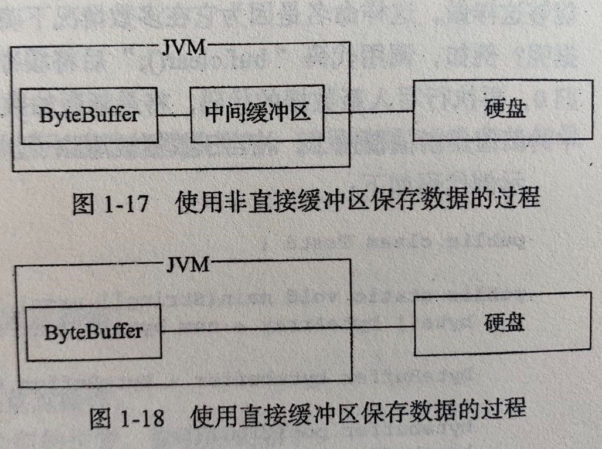
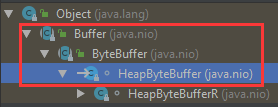

[TOC]


# Buffer

## 1. 介绍
> Buffer是一个用于存储基本数据类型的容器，它以类似于数组有序的方式来存储和组织数据。
## 2. uml
*   Buffer类与其子类的继承关系，Buffer与其子类为抽象类，无法直接实例化   

## 3. 核心概念
1. capacity 容量：缓冲区的大小
   1. 从0开始索引，capacity表示最后一个可用的位置
2. limit 限制：
   1. 从0开始索引，limit表示第一个无法被写入/读取的位置
   2. 不能为负
   3. 不能大于capacity
3. position 位置：缓冲区当前位置，在读取、写入操作后，自动递增
4. mark 标记：标记
5. remaining 剩余空间：limit-position
6. 相对位置：从当前position操作一个或多个元素
7. 绝对位置：根据index位置操作元素，超出限制时`throw new IndexOutOfBoundsException()`
## 4. 初始化
#### 4.1 初始化
1. static ByteBuffer wrap(byte[] array,int offset, int length): 填充缓冲区
    ```java
    byte[] bytes = new byte[]{1, 2, 3};
    ByteButter.wrap(bytes);
    ```
2. static ByteBuffer allocate(int capacity): 分配一个capacity大小的缓冲区
    ```java
    ByteBuffer.allocate(3);
    ```
3. static ByteBuffer allocateDirect(int capacity): 分配新的直接缓冲区
   ```java
   ByteBuffer.allocateDirect(3);
   ```
#### 4.2 直接缓冲区与非直接缓冲区
1.  保存数据的过程  
    

    *   非直接缓冲区：每次需要将数据暂存到jvm的中间缓冲区
    *   直接缓冲区：
        *   在内核空间处理数据，减少了在jvm中创建中间缓冲区的步骤，提高了效率
        *   直接缓冲区善于保存受I/O操作影响的大量、长时间保存的数据

2.  判断是否为直接缓冲区
    ```java
    abstract boolean isDirect(): 为true则为直接缓冲区
    ```
3.  缓冲区类与非缓冲区类的底层实现类
    *   `wrap()`、`allocate()`方法底层返回的是`new HeapByteBuffer()`
	*   `allocateDirect()`方法底层返回的是`new DirectByteBuffer()`

4.  HeapByteBuffer  

    *   `HeapByteBuffer`为`ByteBuffer`的子类
    *   `ByteBuffer`的技术原理是使用byte[]数组进行数据的保存，在后续使用指定的api操作这个数组
    *   `HeapByteBuffer`重写了`ByteBuffer`的大部分方法，调用api时，执行的是`HeapByteBuffer`类中重写的方法  
5.	DirectByteBuffer
	
	*	手动释放资源：通过反射拿到`cleaner()`，通过它的返回值得到`Cleaner`对象，再调用`Cleaner`对象的`clean()`

## 5. Buffer主要方法
#### 5.1.	标志位操作  
1.  limit
    ```java
    final int limit(): 返回当前limit
    final Buffer limit(int newLimit): 设置新的limit。0<newLimit<capacity
    ```
2.  position
    ```java
    final int position(): 返回当前position
    final Buffer position(int newPosition): 设置新的position。0<newPosition<limit。newPosition>limit时，limit=newPosition
    ```
3.	mark
    *	0<=mark<position
    *	当limit、position小于mark时，mark被丢弃，此时mark=-1
    ```java
    final Buffer mark(): 设置mark
    final Buffer reset(): 将当前position位置设置为mark的位置
    InvalidMarkException(): 当未定义mark并调用reset()时抛出
    ```
#### 5.2.	判断缓冲区状态
1.	abstract boolean isReadOnly(): 判断是否为只读缓冲区
2.	abstract boolean isDirect(): 判断是否为直接缓冲区
4.	final boolean hasArray(): 当缓冲区为非直接缓冲区时，为true
5.	final boolean hasRemaining(): 判断limit-position是否为0，为0时则为true
#### 5.3.	获得缓冲区数据
1.	final int arrayOffset(): 获得数组中第一个缓冲区元素的偏移量
#### 5.4.	缓冲区操作
1.	final Buffer clear(): 还原缓冲区状态
	*	position = 0;
	*	limit = capacity;
	*	mark = -1;
2.	final Buffer flip(): 反转缓冲区，将当前position设为limit，类似于截取子串
	*	limit = position;
	*	position = 0;
	*	mark = -1;
3.	final Buffer rewind(): 重置position、mark，limit未变。用于重新访问缓冲区
4.	clear、flip、rewind之间的区别与联系
	*	`clear()`将缓冲区设为初始状态
	*	`flip()`未限制capacity，只是将缓冲区截成了0-position大小的区域（limit）
	*	`rewind()`可以用于从头访问缓冲区

## 6.	ByteBuffer主要方法
#### 6.1.	缓冲区初始化
1.	static ByteBuffer wrap(byte[] array, int offset, int length)
	*	由于缓冲区数组hb是原数组的引用，因此任意一方的修改都将导致另外一方修改
	*	capacity = array.length，将array全量赋值给缓冲区
	*	position = offset，offset为赋值后，当前缓冲区的位置
	*	limit = offset+length
#### 6.2.	单数据读写
1.	abstract ByteBuffer put(byte b)
2.	abstract byte get()
3.	abstract ByteBuffer put(int index, byte b)
4.	abstract byte get(int index)
#### 6.3.	批量数据读写
1.	ByteBuffer put(byte[] src, int offset, int length)
	*	将目标数组引用到缓冲区中
	*	先检查buffer剩余大小是否足够。若length>buffer.remaining()，`throw new BufferOverflowException()`
	*	offset：src的偏移量，从0开始。0<=offset<src.length
	*	length：从src中读取的数量，0<offset+length<=src.length
2.	ByteBuffer get(byte[] dst, int offset, int length)
	*	将缓冲区引用到目标数组
	*	先检查buffer剩余大小是否足够。若length>buffer.remaining()，`throw new BufferUnderflowException()`
	*	offset：dst的偏移量
	*	length：写入dst的数量
	```java
	byte[] bytes = new byte[buffer.capacity()];
    buffer.get(bytes, 2, 4);
	```
3.	ByteBuffer put(ByteBuffer src): 将src剩余的数据（src.remaining()）赋值给当前缓冲区
#### 6.4.	缓冲区操作
1.	创建新的引用子缓冲区：`abstract ByteBuffer slice()`
	*	创建新的字节缓冲区。`newBuffer.capacity = limit - position`
    *   为源缓冲区的引用子序列，即一方修改内容，另一个也会被修改
	*	标志位独立。即position、mark、limit相互独立
	*	属性共享。即是否只读、是否为直接缓冲区是一致的
	*	`newBuffer.arrayOffset()`为newBuffer第一个元素相对于源buffer的偏移
2.  创建新的引用缓冲区：`abstract ByteBuffer duplicate()`
    *   与`slice()`大致相同，不同点有
        *   `duplicate()`是原缓冲区的全量复制，复制后`position`、`limit`、`capacity`与原缓冲区相同
        *   `newBuffer.arrayOffset()`返回0
    *   相同点
        *   标志位复制完成后是独立的
        *   属性共享
3.	创建只读缓冲区：`abstract ByteBuffer asReadOnlyBuffer()`
	*	不允许修改内容
	*	标志位独立。即position、mark、limit相互独立
	*	初始化后capacity、limit、position、mark与原缓冲区相同
4.	压缩缓冲区：abstract ByteBuffer compact(): 
    *   将当前position到limit之间的数据复制到缓冲区的开始
	*	压缩后的position为压缩前limit-position的数量
	*	压缩后的limit = capacity
5.  扩容缓冲区
    *   步骤1，创建一个新的`ByteBuffer`，分配足够大的空间
        ```java
        ByteBuffer.allocate(buffer.capacity() + extendSize);
        ```
    *   步骤2，将原数据`put`到新缓冲区中
6.  获得缓冲区长度
    *   字节缓冲区长度：返回长度
    *   字符缓冲区长度：返回[`position`,`limit`)之间的字符数
##### 6.4.4.	比较(以ByteBuffer为例)
1.  `equals()`主要比较`position`到`limit`之间的内容是否一致
    1.	判断是不是自身，如果为自身，则返回`true`
        ```java
        if (this == ob)
            return true;
        ```
    1.  判断是否为`ByteBuffer`的子类，如果不为子类，返回`false`
        ```java
        if (!(ob instanceof ByteBuffer))
            return false;
        ```
    2.  判断剩余`remaining`是否相等，如果不相等，返回`false`
        ```java
        ByteBuffer that = (ByteBuffer)ob;
        if (this.remaining() != that.remaining())
            return false;
        ```
    3.  判断`remaining`中的内容是否相同，如果不相同，返回`false`
        ```java
        int p = this.position();
        for (int i = this.limit() - 1, j = that.limit() - 1; i >= p; i--, j--)
            if (!equals(this.get(i), that.get(j)))
                return false;
        ```
2.  `compareTo()`将缓冲区与另一个缓冲区按照顺序比较它们剩余元素的序列
    1.  以当前`ByteBuffer`的当前位置开始；以两个`ByteBuffer`对象最小的`remaining()`值结束。即判断`remaining()`的交集
        ```java
        int n = this.position() + Math.min(this.remaining(), that.remaining());
        ```
    2.  如果在`remaining()`的交集中，在当前比较的位置上出现了不同的字节，则返回两者的减数
        ```java
        for (int i = this.position(), j = that.position(); i < n; i++, j++) {
            int cmp = compare(this.get(i), that.get(j));
            if (cmp != 0)
                return cmp;
            
        private static int compare(byte x, byte y) {
            return Byte.compare(x, y);
        }
        ```
    3.  若每个字节都相同，则返回两者`remaining()`的减数
        ```java
        return this.remaining() - that.remaining();
        ```
#### 6.5.	缓冲区类型转换

1.	可以创建如上图所示的缓冲区视图
2.	view.capacity = limit
3.	标志位独立。即position、mark、limit相互独立
4.	属性共享。即是否只读、是否为直接缓冲区是一致的
5.	容量根据对应视图所占的字节数决定
	*	CharBuffer为`src.remaining()`的一半。因为一个字符等于两个字节，ByteBuffer为一个字节
#### 6.6.	缓冲区字节顺序
1.	final ByteOrder order(): 获得字节顺序
2.	static final ByteOrder BIG_ENDIAN: 字节顺序为从高到底
3.	static final ByteOrder LITTLE_ENDIAN: 字节顺序为从低到高