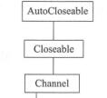
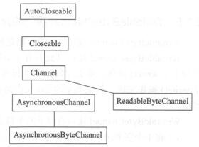
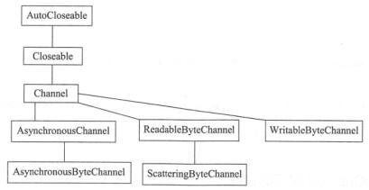

> 通道代表数据到硬件设备、文件、网络套接字的连接
# 1. `Channel`

1. `isOpen()`:返回通道是否打开
2. 继承`AutoCloseable`可以自动关闭通道，也可以使用`close()`手动关闭通道
# 2. 子接口

## 2.1. 异步通道
1. `AsynchronousChannel`  

   1. 异步IO主要由以下两种方式实现
      1. 方法:`Future<V> operation()`
         1. operation:为操作方法
         2. V:结果的数据类型
         3. Future:Future对象,用于检测操作是否完成等
      2. 回调:`void operation(..., A attachment, CompletionHandler<V,? super A> handler)`
         1. A对象与`CompletionHandler`进行通信
         2. 使用`CompletionHandler`实现异步IO
   2. 线程安全的
   3. 支持并发,但是不允许在未完成的IO操作上调用`read()`或`write()`
   4. 取消/离开通道:
      1. 支持`java.util.concurrent.Future#cancel`方法取消.会向等待的异常抛出`CancellationException`
      2. IO能否被取消取决于底层实现
      3. 当取消当前操作离开通道时,会将通道置为一个错误的状态,会阻止接下来的`read()`或`write()`
      4. 当调用`cancel()`离开通道时,等待IO结果的线程会抛出`CancellationException`,通道中未完成的操作会抛出`AsynchronousCloseException`
2. `AsynchronousByteChannel`  

   1. 操作字节的异步IO通道
3. `InterruptibleChannel`  

   1. 可以异步的中断、关闭通道
   2. 其他线程可以调用阻塞线程的`interrupt()`方法关闭阻塞线程占用的通道。阻塞线程会收到`ClosedByInterruptException`异常。通道会处于中断状态
## 2.2. 读通道
### 2.2.1. 单字节读
1. `ReadableByteChannel`

   1. 一次只允许一个写操作在进行
### 2.2.2. 多字节读
1. `ScatteringByteChannel`

## 2.3. 写通道
### 2.3.1. 单字节写
1. `WritableByteChannel`  

   1. 使通道可以写字节
   2. 一次只允许一个写操作在进行
### 2.3.2. 多字节写
1. `GatheringByteChannel`  

## 2.4. 读写通道
1. `ByteChannel`  

   1. 继承了`ReadableByteChannel`和`WritableByteChannel`，同时实现了通道的读和写的操作
2. `SeekableByteChannel`  

   1. 在通道中允许改变`position`
## 2.5. 网络通道
1. `NetworkChannel`  

   1. 与socket关联，使用socket技术发送通道中的数据
2. `MulticastChannel`  

   1. 支持IP多播发送数据
# 3. 实现类
## 3.1. `AbstractInterruptibleChannel`
# TODO
