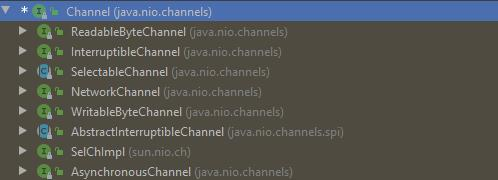

> 通道代表数据到硬件设备、文件、网络套接字的连接
# 1. `Channel`
## 1.1. 继承结构

## 1.2. 方法
1. `isOpen()`:返回通道是否打开
2. `close()`:关闭方法,可以自动关闭
# 2. 子接口
## 2.1. `AsynchronousChannel`:异步IO通道
1. 继承关系  

2. 异步IO主要由以下两种方式实现
   1. 方法:`Future<V> operation()`
      1. operation:为操作方法
      2. V:结果的数据类型
      3. Future:Future对象,用于检测操作是否完成等
   2. 回调:`void operation(..., A attachment, CompletionHandler<V,? super A> handler)`
      1. A对象与`CompletionHandler`进行通信
      2. 使用`CompletionHandler`实现异步IO
3. 线程安全的
4. 支持并发,但是不允许在未完成的IO操作上调用`read()`或`write()`
5. 取消:
   1. 支持`java.util.concurrent.Future#cancel`方法取消.会向等待的异常抛出`CancellationException`
   2. IO能否被取消取决于底层实现
   3. 当取消当前操作离开通道时,会将通道置为一个错误的状态,会阻止接下来的`read()`或`write()`
   4. 当调用`cancel()`离开通道时,等待IO结果的线程会抛出`CancellationException`,通道中未完成的操作会抛出`AsynchronousCloseException`
## 2.2. `AsynchronousByteChannel`:异步字节IO通道
1. 继承关系:`extends AsynchronousChannel`
## 2.3. `ReadableByteChannel`:读IO通道
1. 